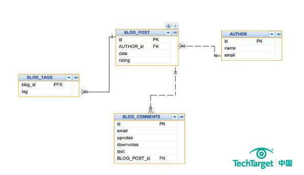

# Elastic Search学习

## 定义

Elastic Search是一个分布式、可拓展、实时的搜索与数据分析引擎，本质是一个非关系型数据库。

## 功能

擅长全文搜索、结构化搜索、数据分析等。

## 倒排索引

关系型数据库通过增加一个 索引，比如一个 B树（B-tree）索引到指定的列上，以便提升数据检索速度。Elasticsearch 使用了一个叫做**倒排索引**的结构来达到相同的目的。

默认的，一个文档中的每一个属性都是被索引的（有一个倒排索引）和可搜索的。一个没有倒排索引的属性是不能被搜索到的。

## 数据源

## 附录

### 关系型数据库和非关系型数据库的对比

#### 存储的形式

以一篇博客文章为例，如果用关系型数据库来存储博客数据，一篇输入的博客，会分散到多个表里面。

一篇博客文章，其中的数据库分到了4个表中，分别是author表，blog_post表、blog_tags表、blog_comments表，非常麻烦。

而如果用非关系型数据库，比如文档型数据库来存储一篇博客。

存储的结果可能是这样的。不需要表与表之间映射的过程。

### 一些名词含义解释

- 索引*index*

  作为名词时，一个索引类似于关系型数据库的一个database，是一个存储关系型文档的地方。 *索引* (*index*) 的复数词为 *indices* 或 *indexes* 。

  作为动词时，索引一个文档，等价于存储一个文档到一个索引中，以便被查询。类似sql语句的insert新数据或者update旧数据。

- 结构化搜索

搜索

