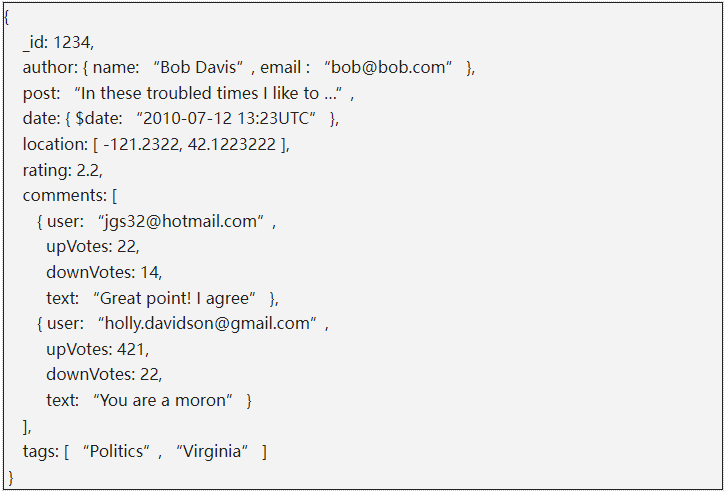

# Elastic Search学习

## 定义

Elastic Search是一个分布式、可拓展、实时的搜索与数据分析引擎，本质是一个非关系型数据库。

## 功能

擅长全文搜索、结构化搜索、数据分析等。

## 倒排索引

关系型数据库通过增加一个 索引，比如一个 B树（B-tree）索引到指定的列上，以便提升数据检索速度。Elasticsearch 使用了一个叫做**倒排索引**的结构来达到相同的目的。

默认的，一个文档中的每一个属性都是被索引的（有一个倒排索引）和可搜索的。一个没有倒排索引的属性是不能被搜索到的。

## 数据源

## 附录

### 关系型数据库和非关系型数据库的对比

#### 存储的形式

以一篇博客文章为例，如果用关系型数据库来存储博客数据，一篇输入的博客，会分散到多个表里面。

一篇博客文章，其中的数据库分到了4个表中，分别是author表，blog_post表、blog_tags表、blog_comments表，非常麻烦。

而如果用非关系型数据库，比如文档型数据库来存储一篇博客。

存储的结果可能是这样的。不需要表与表之间映射的过程。

### 一些名词含义解释

- 索引index

  作为名词时，一个【索引】类似于关系型数据库的一个database，是一个存储关系型文档的地方。 index的复数词为indices或indexes。一个【索引】应该是因共同的特性被分组到一起的文档集合。 例如，你可能存储所有的产品在【索引】products中，而存储所有销售的交易到【索引】sales中。

  作为动词时，索引一个文档，等价于存储一个文档到一个索引中，以便被查询。类似sql语句的insert新数据或者update旧数据。

- 结构化搜索

搜索

- 文档Document

通常情况，术语【对象】和【文档】可以互相替换。不过，有一个区别： 一个对象仅仅是类似于 hash 、 hashmap 、字典或者关联数组的 JSON 对象，对象中也可以嵌套其他的对象。 对象可能包含了另外一些对象。在 Elasticsearch 中，【文档】有着特定的含义。它是指最顶层或者根对象, 这个根对象被序列化成 JSON 并存储到 Elasticsearch 中，指定了唯一 ID。

- 别名alias

索引的别名像一个快捷方式或软连接，可以指向一个或多个索引。

https://www.elastic.co/guide/cn/elasticsearch/guide/current/index-aliases.html